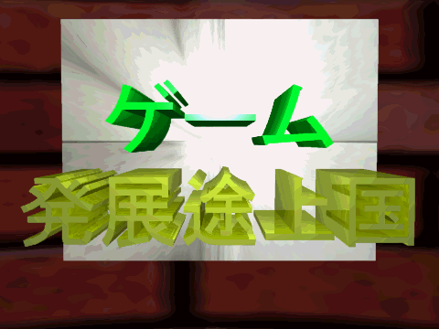

# Assets Directory
This directory contains all the assets included in the original folder, converted to more modern formats for comapatabililty with current software. The unmodified files are present in the original game directory provided, and map to the files here as follows below:

## TITLE.RLE

The game's main background splash (actually flaunted on their website <a href="(https://kairosoft.net/game/pc/gamedev.html#:~:text=20%E4%B8%96%E7%B4%80%E3%81%AE%E6%9C%80%E5%85%88%E7%AB%AF3DCG%E6%8A%80%E8%A1%93%E3%82%92%E4%BD%BF%E3%81%A3%E3%81%9F%E3%82%BF%E3%82%A4%E3%83%88%E3%83%AB%E7%94%BB%E9%9D%A2%E3%82%82%E5%BF%85%E8%A6%8B%E3%81%A7%E3%81%99%E3%80%82)">here</a>.) is encoded in a RLE (Run-Length Encoding) format that is effectively completely unsupported nowadays. As such, it has also been converted into a 24-bit bitmap file, to allow viewing.

## Bitmaps

### Color.bmp
A 1 pixel bitmap of  ■  (#808080) the exact middle of the 24-bit color spectrum. Not displayed due to size.

### Hard00.bmp, Hard01.bmp, Hard02.bmp, Hard03.bmp, Hard04.bmp, Hard05.bmp, Hard07.bmp, Hard08.bmp, Hard09.bmp 

 Depict various images of game consoles, used throughout the game's menus. While the original files display fine in Windows (and by extension in-game), they have issues displaying in some modern software, the top half appearing transparent.

### Hard06.bmp

Depicts an image of a PC, used in the 'Act >> Buy Equipment' dialog's lowest tier option.

## .WAV Files

### GOLD.WAV
A WAV file of a coin sound effect, plays whenever a purchase is made manually in-game.

### Machine.wav
A WAV file of a vending machine sound effect, used whenever an employee uses a vending machine.